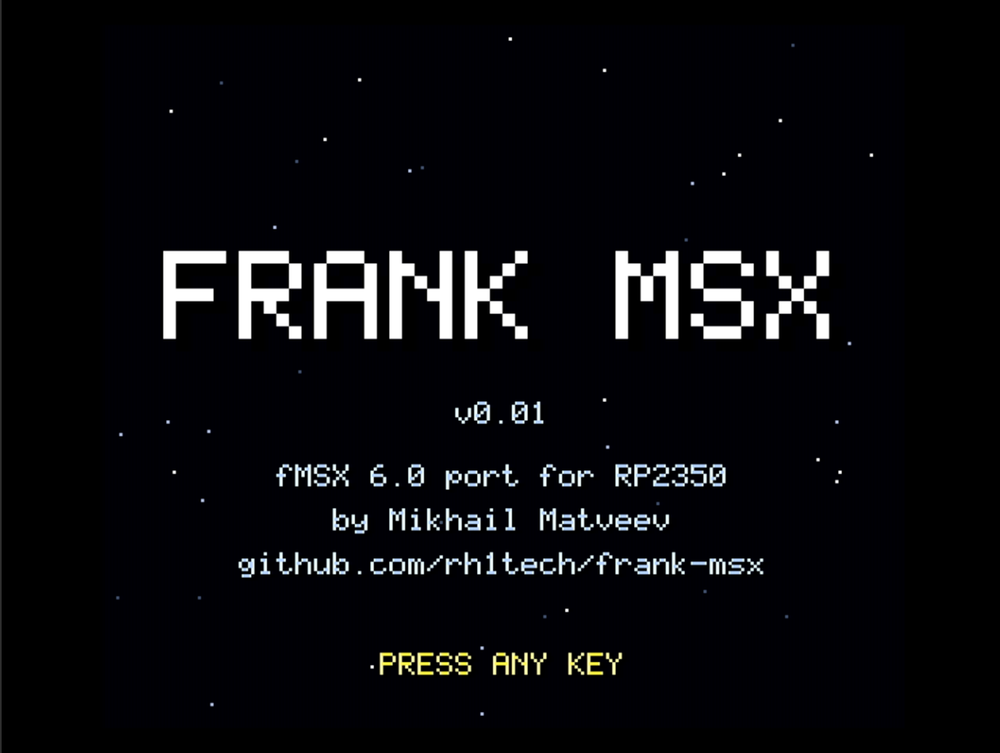
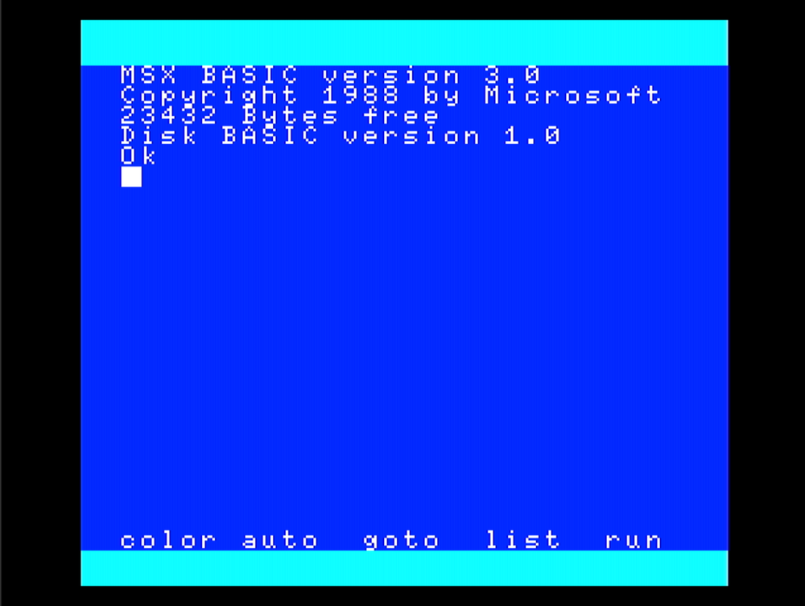
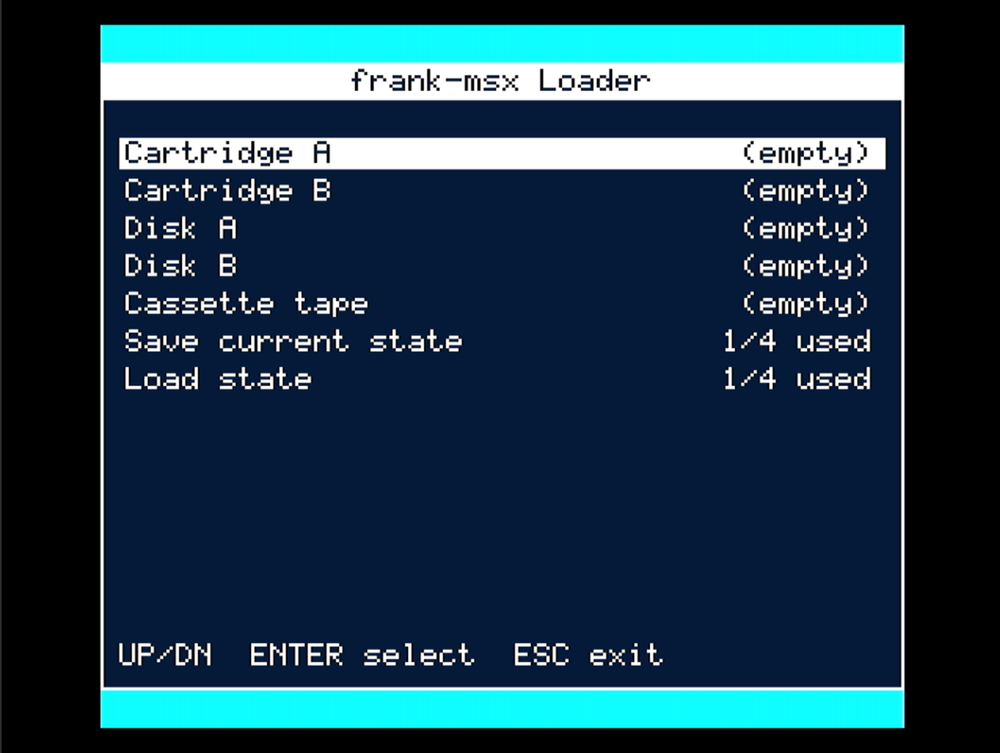
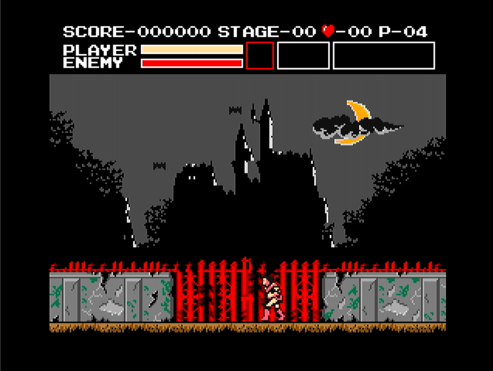
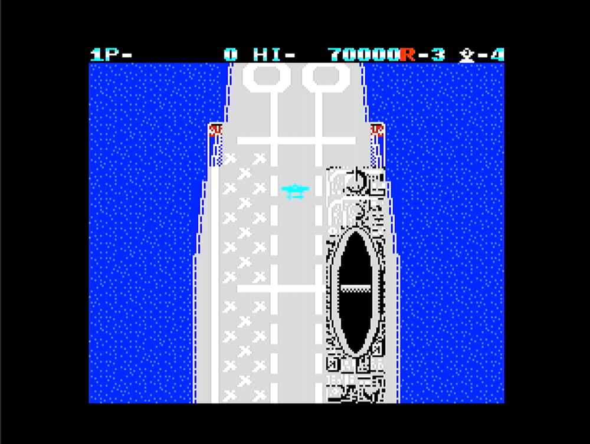

# FRANK MSX

MSX / MSX2 / MSX2+ emulator for the Raspberry Pi Pico 2 (RP2350). HDMI, VGA, and composite-TV output. SD card ROM browser. PS/2 keyboard and mouse, NES/SNES gamepads, optional USB HID (keyboard, mouse, gamepad, XInput). Cassette (`.CAS`) loading. Audio over HDMI, I2S, or PWM.

Based on [fMSX](https://fms.komkon.org/fMSX/) by Marat Fayzullin, ported to RP2350 with the author's permission.

## Screenshots

<p align="center">
  <br>
  <em>Welcome screen</em>
</p>

<p align="center">
  <br>
  <em>Loader overlay (F11): cartridge, disk, tape, save-state slots</em>
</p>

<p align="center">
  <br>
  <em>Game running. MSX2+, PAL, 512 KB RAM, 512 KB VRAM</em>
</p>

<p align="center">
  <br>
  <em>Settings menu (F12)</em>
</p>

<p align="center">
  <br>
  <em>Save-state picker: six slots, thumbnails, per-slot save/load/delete</em>
</p>

## Supported platforms

Five RP2350 boards. Each has its own pin layout and its own set of video and audio backends.

| Platform | Board | Video backends | Audio backends |
|----------|-------|----------------|----------------|
| m2 | [Murmulator 2.0](https://murmulator.ru) / [FRANK](https://rh1.tech/projects/frank?area=about) | HDMI (HSTX), HDMI+VGA (PIO w/ autodetect), VGA (HSTX via DispHSTX), composite TV | HDMI, I2S, PWM |
| m1 | Murmulator 1.x | HDMI+VGA (PIO w/ autodetect), composite TV | I2S, PWM |
| dv | [Pimoroni Pico DV Demo Base](https://shop.pimoroni.com/products/pimoroni-pico-dv-demo-base) | HDMI+VGA (PIO) | PWM |
| pc | [Olimex RP2040-PICO-PC](https://www.olimex.com/Products/MicroPython/PICO/RP2040-PICO-PC/) | HDMI+VGA (PIO) | PWM |
| z0 | [Waveshare RP2350-PiZero](https://www.waveshare.com/rp2350-pizero.htm) | HDMI+VGA (PIO) | PWM |

Select the platform at build time: `PLATFORM=dv ./build.sh`. Default is `m2`. The build picks the video driver to match and rejects combinations that aren't wired up (HSTX HDMI/VGA is M2-only, composite TV is M1/M2-only).

## Features

### Emulation

- MSX1, MSX2, MSX2+. Switchable at boot and from the F12 menu.
- NTSC (60 Hz) and PAL (50 Hz).
- Up to 512 KB main RAM, 512 KB VRAM.
- V9938 and V9958 VDP (Screen 0 through Screen 12).
- Z80, 8255 PPI, 8251 UART.
- Floppy (WD1793), up to two drives.
- Cassette `.CAS` via fMSX's BIOS tape traps. Optional real-time waveform generator for the few titles whose loaders skip BIOS.
- MegaROM mappers: Konami, Konami SCC, ASCII8, ASCII16, GenericROM, RType, Cross Blaim, Harry Fox, Halnote, Majutsushi, and more. The loader auto-guesses; a manual override is available per cartridge.
- FMPAC (MSX-MUSIC) via `FMPAC.ROM`.

### Sound

- AY-3-8910 PSG (6 channels).
- Konami SCC+ (5 channels).
- YM2413 OPLL for FMPAC / MSX-MUSIC (9 channels).
- Mixer runs at 22.05 kHz with a 4:1 soft-knee limiter instead of a hard int16 clamp.
- Three audio backends, switchable from the F12 menu without a restart:
  - HDMI: audio rides on the HDMI data-island channel. HSTX builds only.
  - I2S: external DAC on GP9/10/11. M1/M2 only.
  - PWM: two-pin PWM into an RC low-pass filter. Works on every board.
  - Disabled: silence.

### Video

- 256×212 MSX output, centred inside the 320-pixel scanout.
- Live palette filter: Normal, Monochrome, Sepia, Green, Amber.
- Optional scanlines.
- Runtime HDMI/VGA autodetect on the M1/M2 PIO driver. Plug an HDMI-to-VGA ribbon into the HDMI connector and the TMDS pipeline switches to VGA timings at boot, no rebuild.
- HSTX HDMI on M2 with HDMI audio via data islands.
- HSTX VGA on M2 via DispHSTX (640×480, 2× upscaled from 320×240).
- Software composite PAL/NTSC on M1/M2, on the same pins as the HDMI DAC. CPU clocks to 378 MHz for this mode.
- Frame skip: none, 1:2, 1:3, 1:4, 1:5.
- "All sprites" mode that lifts the MSX's 4-sprites-per-line limit. Kills a lot of sprite flicker.

### Storage

- FAT32 SD card over SPI (or PIO-SPI on boards where the pin layout won't map to a hardware SPI peripheral).
- One directory on the card (`/MSX/`) holds everything: BIOS ROMs and software.
- Files are loaded on demand from the F11 overlay: cartridges, floppies, tapes.
- Mapper picker overlay after a cartridge is selected.
- Six save-state slots per ROM. Each slot has a thumbnail and its own save, load, and delete actions.
- Settings persisted to `/MSX/msx.ini`.

### Input

- PS/2 keyboard (PIO bit-bang driver). Japanese-MSX layout remapper is built in: Shift+digit produces the punctuation the Japanese BIOS expects (`!"#$%^&*()`), and `;:@[]{}<>?` land on the right matrix cell no matter what a US-layout host keyboard sends.
- PS/2 mouse, two-button. IntelliMouse is auto-detected; the wheel is not forwarded to the MSX.
- NES and SNES gamepads wired directly. Two pads map to MSX joystick ports A and B.
- USB HID: keyboard, mouse, gamepad, XInput. Optional at build time. Mutually exclusive with USB CDC stdio.
- Ctrl+Alt+Del triggers an MSX reset.

## Hardware requirements

- Raspberry Pi Pico 2 (RP2350) or a compatible board.
- 8 MB QSPI PSRAM. Mandatory. Main RAM, VRAM, and the mapper/tile cache all live in PSRAM.
- HDMI or VGA connector wired to the TMDS pins through 270 Ω resistors. No encoder IC needed.
- SD card socket (SPI).
- PS/2 keyboard. Recommended: the MSX is a keyboard computer.
- NES or SNES gamepad, wired directly. Optional.
- I2S DAC (TDA1387, PCM5102, etc.). Optional: PWM audio works without a DAC.
- Cassette input. Optional: a single GPIO samples a line-level audio signal for loading real tapes.

> USB note: when USB HID is enabled, the native USB port is used for keyboards, mice, and gamepads, and USB CDC stdio is disabled. Use UART on the SWD/UART pins for console output on release builds.

### PSRAM

The 8 MB PSRAM is not optional. Main RAM, VRAM, the ROM cache, and all per-ROM chunks live there. Without PSRAM there isn't enough room for MSX2+ with 512 KB RAM + 512 KB VRAM plus large MegaROMs.

Three ways to get PSRAM hardware:

1. Solder a PSRAM chip on top of the flash on a Pico 2 clone. Only clones expose the SOP-8 flash pads; the original Pico 2 does not.
2. Build a [Nyx 2](https://rh1.tech/projects/nyx?area=nyx2), a DIY RP2350 board with integrated PSRAM.
3. Buy a [Pimoroni Pico Plus 2](https://shop.pimoroni.com/products/pimoroni-pico-plus-2?variant=42092668289107), a ready-made Pico 2 with 8 MB PSRAM.

## Pin assignment (M2 layout)

Pin maps for the other platforms are in `src/board_m1.h`, `src/board_dv.h`, `src/board_pc.h`, and `src/board_z0.h`.

### HDMI / VGA (through 270 Ω resistors)

| Signal | GPIO |
|--------|------|
| CLK-   | 12   |
| CLK+   | 13   |
| D0-    | 14   |
| D0+    | 15   |
| D1-    | 16   |
| D1+    | 17   |
| D2-    | 18   |
| D2+    | 19   |

### SD card (SPI)

| Signal | GPIO |
|--------|------|
| CLK    | 6    |
| MOSI   | 7    |
| MISO   | 4    |
| CS     | 5    |

### NES / SNES gamepad

| Signal | GPIO |
|--------|------|
| CLK    | 20   |
| LATCH  | 21   |
| DATA 1 | 26   |
| DATA 2 | 27   |

Pad 2 shares CLK and LATCH with pad 1. Only DATA differs.

### I2S audio (optional)

| Signal | GPIO |
|--------|------|
| DATA   | 9    |
| BCLK   | 10   |
| LRCLK  | 11   |

### PWM audio

| Signal | GPIO |
|--------|------|
| PWM0   | 10   |
| PWM1   | 11   |

PWM and I2S share GP10/11. The active backend rewires the pins when you switch between them in the menu.

### PS/2 keyboard + mouse

| Signal     | GPIO |
|------------|------|
| KBD CLK    | 0    |
| KBD DATA   | 1    |
| MOUSE CLK  | 2    |
| MOUSE DATA | 3    |

### Cassette input (optional)

| Signal  | GPIO |
|---------|------|
| TAPE IN | 28   |

### PSRAM (auto-detected)

| Chip package | GPIO |
|--------------|------|
| RP2350B      | 47   |
| RP2350A      | 8    |

## Usage

### SD card setup

1. Format an SD card as FAT32.
2. Create one `/MSX/` directory in the root.
3. Put the BIOS ROMs in `/MSX/`. The set you need depends on the model:
   - MSX1: `MSX.ROM`
   - MSX2: `MSX2.ROM`, `MSX2EXT.ROM`, optionally `DISK.ROM`
   - MSX2+: `MSX2P.ROM`, `MSX2PEXT.ROM`, optionally `DISK.ROM`
4. Optional: `FMPAC.ROM` for MSX-MUSIC / FMPAC, `KANJI.ROM` for Japanese text.
5. Copy your software into `/MSX/` too: `.rom`, `.mx1`, `.mx2`, `.dsk`, `.cas`. Subdirectories are fine.
6. Insert the card. Power on.

### First boot

A welcome splash runs for a few seconds. If the SD card is missing or a required BIOS ROM isn't there, the emulator paints a full-screen error naming exactly which file is missing, then waits for a power cycle. fMSX never gets to panic silently on a broken card.

Settings persist to `/MSX/msx.ini`. Save-state slots live in `/MSX/.states/{rom}_{slot}.sta`.

### During gameplay

- F11: loader overlay (cartridges, disks, tape, save / load state).
- F12: settings menu.
- Ctrl+Alt+Del: hard-reset the MSX.
- Select + Start on a gamepad: same as F12.

### Loader overlay (F11)

The F11 overlay is a file browser drawn on top of the running MSX. One row per target:

| Target             | What happens |
|--------------------|--------------|
| Cartridge A        | Pick a `.rom` / `.mx1` / `.mx2`, choose mapper (or auto), MSX hard-resets. |
| Cartridge B        | Same, but mounts into slot B (e.g. SCC cartridges, game expansions). |
| Disk A             | Pick a `.dsk`. MSX keeps running; BASIC can just `FILES`. |
| Disk B             | Same, drive B. |
| Cassette tape      | Pick a `.cas`. Rewinds on mount. Toggle between file mode and GPIO line-in. |
| Save current state | Pick one of six slots to save to. |
| Load state         | Pick one of six slots to load from, or delete. |

The mapper picker appears after you select a cartridge ROM. The default auto-guess works for almost everything; the manual override is there for ROMs that have been renamed or dumped in a non-standard layout.

### Settings menu (F12)

| Setting         | Options                                                      | Live / needs reset |
|-----------------|--------------------------------------------------------------|--------------------|
| Model           | MSX1, MSX2, MSX2+                                            | Needs reset        |
| Region          | NTSC, PAL                                                    | Needs reset        |
| RAM             | 64 / 128 / 256 / 512 KB                                      | Needs reset        |
| VRAM            | 32 / 64 / 128 / 256 / 512 KB                                 | Needs reset        |
| Joystick 1 / 2  | Empty, Joystick, Mouse as Joystick, Mouse                    | Needs reset        |
| Scanlines       | Off, On                                                      | Live               |
| Colour filter   | Normal, Monochrome, Sepia, Green, Amber                      | Live               |
| Audio backend   | HDMI, I2S, PWM, Disabled (available set depends on platform) | Live               |
| Frame skip      | None, 1:2, 1:3, 1:4, 1:5                                     | Live               |
| All sprites     | Off, On (disables the 4-sprites-per-line limit)              | Live               |
| Autofire A / B  | Off, On                                                      | Live               |
| Autospace       | Off, On                                                      | Live               |
| Fixed font      | Off, On (forces `DEFAULT.FNT`)                               | Live               |
| FMPAC           | Off, On (try to load `FMPAC.ROM` on reset)                   | Needs reset        |
| Cheats          | Off, On                                                      | Live               |

"Needs reset" settings are applied together on Apply-and-Reset. "Live" settings take effect immediately without interrupting the running program.

## Controller support

### PS/2 keyboard

Default mapping is a full MSX keyboard. Special keys:

| PS/2 key             | MSX key / action |
|----------------------|------------------|
| Esc                  | ESC              |
| F1 – F5              | F1 – F5          |
| Home                 | HOME             |
| End                  | SELECT           |
| Page Up              | STOP             |
| Page Down            | COUNTRY          |
| Insert / Delete      | INS / DEL        |
| Left Alt / Right Alt | GRAPH            |
| F11                  | Loader overlay   |
| F12                  | Settings menu    |
| Ctrl+Alt+Del         | Hard reset       |

The Japanese-layout remapper fires for `!"#$%^&*()`, punctuation, brackets, and Shift+punctuation, so host typing produces the character you expect on a Japanese BIOS (which is what most games and MSX2+ BASIC assume).

### PS/2 mouse

A two-button PS/2 mouse shows up as an MSX mouse on port A when the matching joystick slot is set to Mouse or Mouse-as-Joystick. IntelliMouse (three-button + wheel) is auto-detected; the wheel is not forwarded to the MSX.

### NES gamepad

| NES button     | MSX joystick              |
|----------------|---------------------------|
| D-pad          | UP / DOWN / LEFT / RIGHT  |
| A              | FIRE A                    |
| B              | FIRE B                    |
| Start          | —                         |
| Select         | —                         |
| Select + Start | Settings menu             |

### SNES gamepad

Auto-detected. A and B map to MSX FIRE A and FIRE B.

### USB HID gamepad / XInput

Standard USB HID gamepads and XInput controllers (Xbox 360, Xbox One, compatible) work when the firmware is built with `USB_HID=1`. Up to two pads map 1:1 to MSX ports A and B.

### Cassette tape

Mount `.CAS` images from the F11 overlay. Two input modes:

- File (default). fMSX's BIOS traps consume the tape straight from the image. Fast and transparent. Works for any `.CAS` that does its loading through BIOS.
- Line-in. A GPIO samples a real audio signal, and the PSG port-14 bit-7 tape-in reads the resulting waveform. Useful for plugging in a real cassette deck.

For the handful of games that use custom tape loaders bypassing BIOS, the F11 tape page has a Turbo-tape toggle that enables a real-time waveform generator fed by the `.CAS` image.

## Building

### Prerequisites

1. [Raspberry Pi Pico SDK](https://github.com/raspberrypi/pico-sdk) 2.0+.
   ```bash
   export PICO_SDK_PATH=/path/to/pico-sdk
   ```
2. ARM GCC toolchain (`arm-none-eabi-gcc`).
3. Clone the repo:
   ```bash
   git clone https://github.com/rh1tech/frank-msx.git
   cd frank-msx
   ```

### Build

```bash
./build.sh                               # Default: M2, PIO HDMI+VGA
PLATFORM=m2 HDMI_HSTX=1 ./build.sh       # M2, HSTX HDMI with HDMI audio
PLATFORM=m2 VGA_HSTX=1  ./build.sh       # M2, HSTX VGA via DispHSTX
PLATFORM=m2 VIDEO_COMPOSITE=1 ./build.sh # M2, software composite TV
PLATFORM=m1 ./build.sh                   # Murmulator 1.x
PLATFORM=dv ./build.sh                   # Pimoroni Pico DV Demo Base
PLATFORM=pc ./build.sh                   # Olimex PICO-PC
PLATFORM=z0 ./build.sh                   # Waveshare RP2350-PiZero
```

Output: `build/frank-msx.uf2`.

### Build options

All options are environment variables (or CMake cache entries).

| Variable          | Default    | Effect |
|-------------------|------------|--------|
| `PLATFORM`        | `m2`       | `m1` / `m2` / `dv` / `pc` / `z0` |
| `HDMI_HSTX`       | `0`        | `1` enables the HSTX HDMI driver with HDMI audio. M2 only. |
| `VGA_HSTX`        | `0`        | `1` enables the HSTX VGA driver via DispHSTX. M2 only. |
| `VIDEO_COMPOSITE` | `0`        | `1` enables the software composite-TV driver. M1 / M2 only. |
| `MSX_MODEL`       | `3`        | `1` = MSX1, `2` = MSX2, `3` = MSX2+. Runtime-switchable from the menu. |
| `USB_HID`         | `0`        | `1` enables USB HID host (keyboard, mouse, gamepad, XInput). |
| `CPU_SPEED`       | `252` MHz  | CPU clock in MHz. Composite-TV builds default to 378 MHz. |
| `PSRAM_SPEED`     | `133` MHz  | PSRAM max frequency. |
| `FLASH_SPEED`     | `66` MHz   | Flash target max frequency. |

`HDMI_HSTX`, `VGA_HSTX`, and `VIDEO_COMPOSITE` are mutually exclusive.

### Release build

`release.sh` builds every supported (platform × video) combination at once:

```bash
./release.sh            # prompts for a version number
./release.sh 1.05       # version 1.05
```

Output goes to `release/frank-msx_*_{version}.uf2`, one UF2 per combination: M2 HDMI HSTX, M2 VGA HSTX, M2 PIO HDMI, M2 composite TV, M1 PIO, M1 composite TV, DV, PC, Z0.

Release builds default to `USB_HID=1`. `USB_HID=0 ./release.sh` produces a set with CDC stdio instead.

### Flashing

With the board in BOOTSEL mode:

```bash
./flash.sh
# or
picotool load build/frank-msx.uf2
```

## Troubleshooting

### Full-screen error about a missing ROM

The BIOS ROM for the selected MSX model isn't on the card in `/MSX/`. See "SD card setup" above. Copy the ROMs, reset.

### Device won't boot after changing settings

Delete `/MSX/msx.ini` on the SD card to restore defaults.

### Audio only works on one backend

Not all backends exist on every platform (see the platform table). HDMI audio is HSTX-only. I2S needs a DAC on GP9/10/11 and is wired up on M1/M2 only. The menu hides the unavailable ones.

### A MegaROM cartridge doesn't work

Use the mapper picker in the F11 cartridge overlay to override the auto-guess. Konami, Konami SCC, ASCII8, and ASCII16 cover the vast majority of commercial titles.

### Composite TV runs very slowly

Composite TV needs the CPU at 378 MHz. `build.sh` sets that automatically when `VIDEO_COMPOSITE=1`. If you overrode `CPU_SPEED` at build time, drop the override for composite builds.

### First boot feels slow

Most of the delay is the 5-second USB CDC enumeration window (so a host has a chance to open the console). Release builds with USB HID on and CDC off skip it.

## License

Copyright (c) 2026 Mikhail Matveev &lt;xtreme@rh1.tech&gt;

The frank-msx port, drivers, and platform layer are licensed under the GNU General Public License v3.0. See [LICENSE](LICENSE) for the full text.

The fMSX emulator core, EMULib, and Z80 emulator in `src/fMSX/`, `src/EMULib/`, and `src/Z80/` are copyright Marat Fayzullin (1994–2021) and keep their original [fMSX license](LICENSE.fMSX). Marat granted permission for this RP2350 port in private correspondence; contact him directly for any other redistribution.

Third-party drivers and libraries keep their own licenses:

| Component                   | Author                                           | License                                 | Where                                                        |
|-----------------------------|--------------------------------------------------|-----------------------------------------|--------------------------------------------------------------|
| fMSX + EMULib + Z80         | Marat Fayzullin                                  | fMSX (non-commercial, notify-on-change) | `src/fMSX/`, `src/EMULib/`, `src/Z80/`                       |
| FatFS                       | ChaN                                             | BSD-style permissive                    | `drivers/fatfs/`                                             |
| pico_fatfs_test SD driver   | elehobica                                        | BSD-2-Clause                            | `drivers/sdcard/`                                            |
| pico_hdmi (HSTX HDMI+audio) | fliperama86                                      | Unlicense                               | `drivers/pico_hdmi/`                                         |
| DispHSTX (HSTX VGA)         | Miroslav Nemecek                                 | MIT                                     | `drivers/disphstx/`                                          |
| Composite-TV driver         | pico-spec (DnCraptor)                            | GPL-3.0                                 | `drivers/tv/`                                                |
| PS/2 driver (PIO)           | mrmltr                                           | GPL-2.0                                 | `drivers/ps2/ps2.c`, `ps2.h`, `ps2.pio`                      |
| TinyUSB + HID host example  | Ha Thach                                         | MIT                                     | `drivers/usbhid/hid_app.c`, `usbhid.h`, `tusb_config.h`      |
| XInput host                 | Ryan Wendland                                    | MIT                                     | `drivers/usbhid/xinput_host.*`                               |
| I2S PIO program             | Raspberry Pi Trading Ltd.                        | BSD-3-Clause                            | `drivers/i2s/audio_i2s.pio`                                  |
| NES pad PIO                 | shuichitakano / fhoedemakers (pico-infones+)     | MIT                                     | `drivers/nespad/`                                            |
| dlmalloc                    | Doug Lea                                         | CC0 / public domain                     | `drivers/dlmalloc.c`                                         |

## Acknowledgments

Thanks to:

- Marat Fayzullin for fMSX, EMULib, and the Z80 emulator (this project would not exist without them) and for allowing the RP2350 port.
- DnCraptor for the pico-spec project (PIO HDMI/VGA and composite-TV drivers).
- fliperama86 for the pico_hdmi HSTX HDMI+audio driver.
- Miroslav Nemecek for the DispHSTX library.
- shuichitakano and fhoedemakers for the NES/SNES PIO gamepad driver.
- mrmltr for the PIO PS/2 driver.
- ChaN for FatFS, elehobica for the PIO-SPI SD driver.
- Ha Thach for TinyUSB, Ryan Wendland for the XInput host driver.
- Doug Lea for dlmalloc.
- The Murmulator community for hardware designs and testing.
- The Raspberry Pi Foundation for the RP2350 and the Pico SDK.

## Author

Mikhail Matveev &lt;xtreme@rh1.tech&gt;

[https://rh1.tech](https://rh1.tech) · [GitHub](https://github.com/rh1tech/frank-msx)
